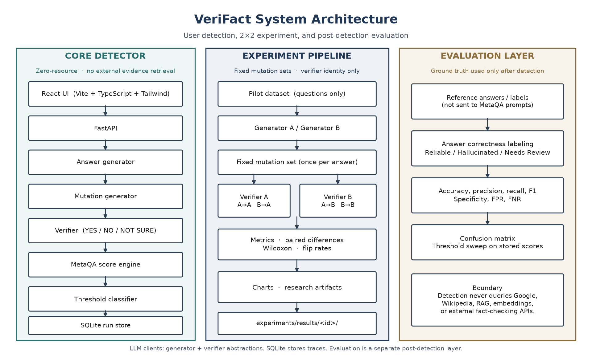

# VeriFact

**Verify what AI says.**

An explainable MetaQA-based system for detecting fact-conflicting hallucinations in large language model responses.


Research-oriented application · v1.0.0 · MIT

## Overview

VeriFact implements the **MetaQA** metamorphic methodology as an interactive detector and a controlled 2×2 experiment. It does not claim to have invented MetaQA. The detector is **zero-resource**: no Google, Wikipedia, RAG, embeddings, or external fact-checking APIs.

## Why Hallucination Detection?

LLMs can produce fluent answers that conflict with established facts. VeriFact checks whether a generated answer stays consistent under meaning-preserving and meaning-reversing restatements, then classifies it with a threshold.

## How VeriFact Works

1. Generate a base answer.
2. Create 5 synonym and 5 antonym mutations (default).
3. Verify each mutation with YES / NO / NOT SURE.
4. Average MetaQA contributions and compare with threshold 0.5.

Ground-truth references are used only **after** detection, for evaluation.

## Research Question

Does using the same LLM as both answer-generator and mutation-verifier produce a systematically different hallucination score than using a different LLM as verifier, after controlling for verifier calibration?

## 2×2 Experimental Design

| | Verifier A | Verifier B |
| --- | --- | --- |
| Generator A | A → A (same) | A → B (cross) |
| Generator B | B → A (cross) | B → B (same) |

Each answer and mutation set is generated once and reused across verifiers.

## Results

Locked experiment `58baff20-fb86-4f43-b20e-895a086ceb6b` · dataset `pilot` v1.0 · n=40 · **Demo / Mock Mode**.

| Condition | Mean score | Hallucinated % |
| --- | --- | --- |
| A → A | 0.0 | 0% |
| A → B | 1.0 | 100% |
| B → A | 0.0 | 0% |
| B → B | 1.0 | 100% |

Scores tracked verifier identity. The live-LLM hypothesis is **inconclusive**. Details: [docs/results.md](docs/results.md), [docs/final_results_lock.md](docs/final_results_lock.md).

## Architecture



React UI → FastAPI → generator → mutations → verifier → MetaQA score → SQLite. See [docs/architecture.md](docs/architecture.md).

## Features

MetaQA detection, explainable mutation verdicts, run history, 2×2 dashboard, threshold sweeps on stored scores, Wilcoxon tests, CSV exports.

## Tech Stack

Frontend: React, Vite, TypeScript, Tailwind. Backend: Python, FastAPI, Pydantic. Database: SQLite. Tests: pytest, ruff, `npm run build`.

## Project Structure

```
backend/      FastAPI detector, evaluation, 2×2 experiment
frontend/     React + Vite UI
docs/         Methodology, results, figures, demo notes
experiments/  Frozen artifacts (see experiments/README.md)
```

## Getting Started

Requires **Python 3.11+** and **Node.js 20+**. On Windows, if `python` is not on PATH, use the launcher `py -3`.

```bash
cd backend
python -m venv .venv
# Windows alternative: py -3 -m venv .venv
.venv\Scripts\activate          # Windows
# source .venv/bin/activate     # macOS/Linux
pip install -r requirements.txt
copy .env.example .env          # or: cp .env.example .env
```

Keep the virtual environment activated when you start the API. `uvicorn` and `pytest` must come from that environment.

```bash
cd frontend
npm install
```

## Configuration

Copy `backend/.env.example` to `backend/.env`. Use placeholders only in examples.

| Variable | Purpose |
| --- | --- |
| `LLM_MODE` | `mock` (CI/demo) or `live` |
| `OPENAI_API_KEY` | Server-side key for live mode |
| `GENERATOR_MODEL_A` / `B` | 2×2 generators |
| `VERIFIER_MODEL_A` / `B` | 2×2 verifiers |
| `THRESHOLD` | Default 0.5 |

Never put API keys in the frontend or README.

## Running the Application

Keep the backend venv activated:

```bash
cd backend
uvicorn app.main:app --reload --port 8000
```

```bash
cd frontend
npm run dev
```

Open `http://localhost:5173`. Mock mode is labeled **Demo / Mock Mode**. Live mode is labeled **Live LLM Mode**.

## Running Tests

```bash
cd backend
pytest
ruff check .
```

```bash
cd frontend
npm run build
```

CI uses `LLM_MODE=mock` and does not call a real LLM provider.

## Running Experiments

```bash
cd backend
python scripts/live_smoke.py
python scripts/run_live_pilot.py --confirm --stage all --max-questions 40
```

Requires `LLM_MODE=live` and a real key. Do not treat mock dashboard numbers as live-model findings.

## Research Documentation

[docs/README.md](docs/README.md) · [docs/demo_script.md](docs/demo_script.md) · [docs/interview_explanation.md](docs/interview_explanation.md)

## Limitations

The locked 2×2 is mock. n=40. Two models in placeholder form. Mutation quality is prompt-constrained. See [docs/limitations.md](docs/limitations.md).

## Future Work

Larger datasets, more model families, repeated live trials, stronger mutation checks. Keep evidence-grounded extensions separate from the MetaQA core.

## Citation

Bibliographic details for the original MetaQA paper are not verified in this repository:

```
TODO: MetaQA original paper (authors, title, venue, year).
```

For this software: *VeriFact: A MetaQA-Based Framework for Detecting Fact-Conflicting Hallucinations in Large Language Models*, v1.0.0.
